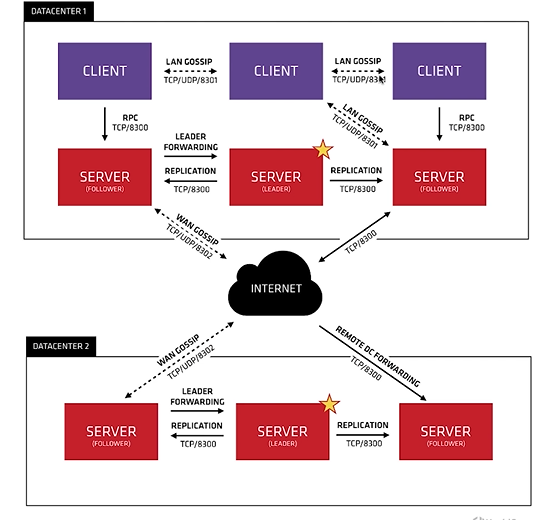
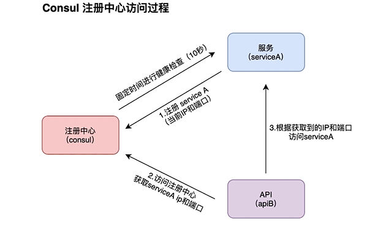
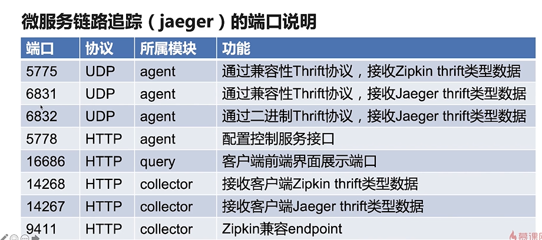

# Consul两个重要协议
* Gossip Protocol  八卦协议
* Raft Protocol    选举协议

## Consul Gossip协议
* 局域网池(LAN Pool)
* 广域网池(WAN Pool)
### Gossip 局域网池（LAN Pool）
 * 让client自动发现server节点，减少所需的配置量
 * 分布式故障检测在某几个Server机上执行
 * 能够用来快速的广播事件
### Goosip 广域网池（WAN Pool）
 * WAN Pool全局唯一
 * 不同数据中心的server都会加如WAN Pool
 * 允许服务器执行跨数据中心的请求


## Consul注册中心访问过程


# 链路追踪（jaeger）
用来监视和诊断基与微服务的分布式系统
## 主要特征
* 高扩展性
* 原生支持OpenTracing
* 可观察性
## Span
* jaeger 中的逻辑工作单元
* 具有操作名称，操作的开始时间和持续时间
* 跨度可以嵌套的并排序以建立因果关系模型

## 微服务链路追踪的五个重要组件
* Jaeger-client (客户端)
* Agent （客户端代理）
* Collector （数据收集处理端）
* Data Store（数据存储）
* UI （数据查询与前端界面展示）

### 端口说明


## docker 拉取和启动
```shell
docker pull cap1573/jaeger
docker run -d --name jaeger -p 6831:6831/udp -p 16686:16686 cap1573/jaeger
```

# 熔断、限流、负载均衡
## 微服务熔断(hystrix-go)介绍
### 微服务熔断目标
* 阻止故障的连锁反应
* 快速失败并迅速恢复
* 回退并优雅降级
* 提供近实时的监控与警告

### 熔断计数器
* 每一个Command 都会有一个默认的统计控制器
* 默认的统计控制器 DefaultMetricCollector

## 限流（uber/limit）
### 作用
* 限制流量，在服务端生效
* 保护后端服务
* 与熔断互补

## 负载均衡
### 作用
* 提高系统的扩展性
* 支持：HTTP、HTTPS、TCP、UDP请求
* 主要算法： 循环算法和随机算法，默认随机算法

## 微服务API网关-总体架构
* 第一层 Micro api网关
* 第二层 聚合业务层
* 第三层 基础服务层
